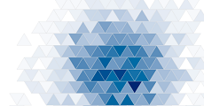
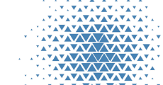

# d3.triangleBin

D3 plugin for doing triangular binning on a set of points.
Useful for visualizing 2D distributions when you have a lot of data points.

Inspired by the [d3.hexbin](https://github.com/d3/d3-plugins/tree/master/hexbin) plugin.

### Examples

<table>
  <tr>
    <td>
      Color Encoding <br>
      <a href="http://bl.ocks.org/armollica/7c0bd51dab6b9665a315fef06c436f27"></a>
    </td>
    <td>
      Area Encoding <br>
      <a href="http://bl.ocks.org/armollica/dcfa9c27db140183bd87f3fc90efaf10"></a>
    </td>
  </tr>
</table>

### How To Use
Save the `triangle-bin.js` file from this repo and include it in your HTML after including D3:
```html
<script src="https://d3js.org/d3.v3.min.js" charset="utf-8"></script>
<script src="triangle-bin.js"></script>
```

### API Reference

TODO (Roughly follows the API of [d3.hexbin](https://github.com/d3/d3-plugins/tree/master/hexbin) plugin)